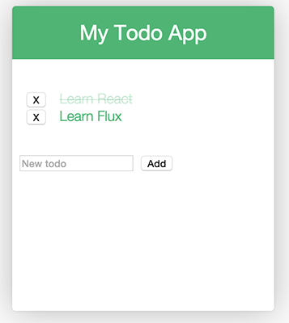

# Composing components

Lets build a todo list app.

First lets break down our app into module, compassable components. For the todo app example, we will have the following structure.



 - ToDo App
  - Title
  - Todo List
    - Todo Item 1
    - Todo Item 2
  - Todo Form
    - Form input
    - Form  button


---

First we build the **TodoList** component, its sole purpose at this time will be to display todo items.

```js
// todo-list.js
import React from 'react';

export default class TodoList extends React.Component {

  render() {
    return (
      <div>Todo List Item</div>
    );
  }
}
```

Next, we update the **Todo** component to use the **Todo List** component.


```js
// todo.js

import React from 'react';
import TodoList from './todo-list/todo-list';

export default class Todo extends React.Component {

  render() {
    return (
      <div>
        <h3>My Grocery List</h3>
        <TodoList />
      </div>
    );
  }
}
```

And finialy we render **Todo** by calling ``` React.render ``` passing in the **component** to render and the **dom node** to render at.
```js
// app.js

import React from 'react';
import Todo from './components/todo/todo';
import './components/todo/todo.scss';

React.render(<Todo />, document.getElementById('app'));
```

**[Run Code](http://jsfiddle.net/fLvsg8t0/)**

---
### Props - Lets talk about PROPS


Before we go any further we need to look at Component Properties.

Its helpful to think of components as **functions** and props as **parameters** to functions. Props allow us to pass data and functions ‘downstream’ to components.

--

#### Props - Passing Data

Currently our **TodoList** component isn't very useful, it just renders out some static text.  Lets pass data into the component.

```js
// todo.js

class Todo extends React.Component {

  render() {
    return (
      <div>
        <h1>My Grocery List</h1>
        <TodoList todo='Item 1'/>
        <TodoList todo='Item 2'/>
        <TodoList todo='Item 3'/>
      </div>
    );
  }
}
```

In **TodoList** we have access to these passed in parameters via the ``` this.props ``` field.
```js
// todo-list.js

class TodoList extends React.Component {

  render() {
    return (
      <div>Item {this.props.todo}</div>
    );
  }
}
```

**[Run Code](http://jsfiddle.net/x633uvme/)**

---

#### :dart: ES6 Tip - Use Spread Operator (...props) :dart:


```js
var props = {
  color: 'white',
  x: 123,
  y: 34
};

var myComp = <MyComponent {...props} />

this.props.color
this.props.x
this.props.y
```


---


#### Props - this.props.children


Instead of hardcoding the title into our **Todo** component, lets pass it down, not as a property on the component but instead as the child element.


```js
React.render(<div>
              <Todo>My Grocery List</Todo>
              <Todo>My Work Tasks</Todo>
             </div>, document.getElementById('app'));

```

Also note that i've created two **Todo** components, each getting passed a different title.

In **Todo** component I can access the children of the component using ``` this.props.children ```.


```js
// todo.js

class Todo extends React.Component {

  render() {
    return (
      <div>
        <h3>{this.props.children}</h3>
        <TodoList todo='Item 1'/>
        <TodoList todo='Item 2'/>
        <TodoList todo='Item 3'/>
      </div>
    );
  }
}

```

**[Run Code](http://jsfiddle.net/tsmckn2z/)**

---

#### :dart: ES6 Tip - Use Deconstruction { } :dart:

```js
class TodoItem extends React.Component {

  render() {
    var { todo } = this.props;

    return (
        <div>Item {todo}</div>
    );
  }
}
```

---

#### Props - Templating

Passing todo items indiviulis into our **TodoList** component just isn't alot of fun, plus we have to make a knew component for each item - this doesn't seem right.


```js
        <TodoList todo='Item 1'/>
        <TodoList todo='Item 2'/>
        <TodoList todo='Item 3'/>
```

You've may of used **handlebars** or **ng-repeat** (if you've done any Angular). Well React has an amazing templating solution also - its called... **JavaScript**, more specifically **map**.


Say we had an array of todo items we wanted to pass into our **TodoList** component.

```js
// todo.js

var todoItems = ['Item 1', 'Item 2', 'Item 3'];

class Todo extends React.Component {

  render() {
    return (
      <div>
        <h3>My Grocery List</h3>
        <TodoList todos={todoItems}/>
      </div>
    );
  }
}

```

We would now have access to them via ``` this.props.todos ``` within our **TodoList** component.

Now to generate some markup (using map) to contain our todo list items, we will store this JSX markup in a variable called **rows**.


```js
// todo-list.js

class TodoList extends React.Component {

  render() {
    var { todos } = this.props
    var rows = todos.map(value => {
      return (<li>Todo {value}</li>);
    });

    return (
      <ul>{rows}</ul>
    );
  }
}
```

**[Run Code](http://jsfiddle.net/v1xb21om/)**

---

#### Props - Key

This works though React will through a warning in the console.

```Warning: Each child in an array or iterator should have a unique "key" prop. Check the render method of TodoList. See http://fb.me/react-warning-keys for more information```


React wants everything generated this way to contain a unquie 'key' property, to help with DOM rendering. Lucky for us this is easy to manage, especially considering map already gives us an index for free.

```js
var rows = todos.map((value, index) => {
  return (<div key={index}>{value}</div>);
});
```

**[Run Code](http://jsfiddle.net/qmgoa8jg/)**

---


#### :dart: ES6 Tip - Use Arrow Functions :dart:


```js
this.test = 'hello world';

var self = this;

var rows = todos.map(function(value) {
  return (<li>{self.test} Todo {value}</li>);
});

```


```js
this.test = 'hello world';

var rows = this.props.todos.map((value) => {
  return (<li>{self.test} Todo {value}</li>);
});

```

---


#### Props - Passing Functions

Functions, like data, can also be passed to components.

It's a very common pattern in React to define a bunch of values/functions at our top level (**root**) component, and pass it all downwards to subcomponents.


Lets add in our **Todo** component (which is our root component), a function that deletes a provided todo items from the **todoItems** array.

```js
var todoItems = ['Item 1', 'Item 2', 'Item 3'];
```

```js
var deleteTodo = function (todo) {
  todoItems.filter(value = > {
    return todo !== value;
  });
};
```

And lets pass **deleteTodo** down to TodoList as a prop on the TodoList component.


```js
// todo.js

class Todo extends React.Component {

  render() {
    return (
      <div>
        <h1>My Grocery List</h1>
        <TodoList onDelete={this.deleteTodo} todos={todoItems} />
      </div>
    );
  }

  deleteTodo(todo) {
    todoItems = todoItems.filter(value => {
      return todo !== value;
    });
    React.render(<Todo />, document.getElementById('app'));
  }
}

```

And from the **TodoList** component we would have access to this function via **this.props.onDelete**.

```js
// todo-list.js

class TodoList extends React.Component {

  render() {
    var { todos, onDelete } = this.props;
    var rows = todos.map((value, index) => {
      return (
        <div key={index}
             onClick={onDelete.bind(null, value)}>
          {value}
        </div>
      );
    });

    return (
      <div>{rows}</div>
    );
  }
}
```

A few things to note:

 -  ``` onClick={this.props.onDelete.bind(null, value)} ```
 - ``` React.render(<Todo />, document.getElementById('app')); ```
  - inside **deleteTodo**


**[Run Code](http://jsfiddle.net/hf02rcdz/)**

---

#### Props - propTypes

**propTypes** allow you to define the type of data that should be passed through props. This is also a great way to document your components.

**TodoList** gets passed two props currently, todos and onDelete. Our propTypes declarations would be...

```js
TodoList.propTypes = {
  todos: React.PropTypes.array,
  onDelete: React.PropTypes.func
};
```

When an invalid value is provided for a prop, a warning will be shown in the JavaScript console.

```Warning: Failed propType: Invariant Violation: TodoList: prop type `onDelete` is invalid; it must be a function, usually from React.PropTypes. Check the render method of `Todo`.```


You can also add the isRequired flag onto PropTypes to throw a warning if a prop is not provided.

```js
TodoList.propTypes = {
  todos: React.PropTypes.array,
  onDelete: React.PropTypes.func.isRequired
};
```

Console warnings will also display if a required prop isn't provided to a component.

```Warning: Failed propType: Required prop `test` was not specified in `TodoList`. Check the render method of `Todo`.```

---

#### defaultProps

React also lets you define default values for your props when they aren't provided to your components.

```js
TodoList.defaultProps = {
  todos: []
};
```

---


### Lets talk about STATE


React provides us with a way to store our UI's state within our components.

```js
this.state.todos = ['Item 1', 'Item 2', 'Item 3'];
```

Calling ```this.setState``` will update state, forcing React to re-render the component.

```js
this.setState({
  todos: todos.concat(['Item 4']);
})
```

Its good practice to store all your components state within your 'root' component. Pass state as props to children component. If you need sub component to alter state, pass functions as props downwards from that parent component, functins that act on the parents state.

--

Lets refactor our array that hold the todo items into our root components state.

In react, the constructor function of the class is used to setup intial state.

```js
constructor(props) {
  super(props);
  this.state = {
    ...
    ...
  };
}
```

We wrap our state in ```this.state```

```js
this.state = {
  todoItems: ['Item 1', 'Item 2', 'Item 3'],
  otherState: '',
  otherState: ''
};
```

And whenever we need to update our state, we call ```this.setState``` and pass in the new state.

```js
this.setState({
  todoItems: ['new todos']
})
```

Whenever we call setState, React will do a ```DOM diff``` and update the UI anywhere ```State``` was updated.

So before we had to call ```Render``` within ```deleteTodo``` to notify React to redraw. Now with setState this would be automatic for us.

```js
deleteTodo(todo, todos) {
  this.setState({
    todoItems: todos.filter(value => {
                return todo !== value;
               })
  })
  // We don't need this anymore
  // React.render(<Todo />, document.getElementById('app'));

}
```

This is what our **Todo** component looks like now after our state refactor.

```js
// todo.js

class Todo extends React.Component {

  constructor(props) {
    super(props);
    this.state = {
      todoItems: ['Item 1', 'Item 2', 'Item 3']
    };
    // this.deleteTodo = this.deleteTodo.bind(this)
  }

  render() {
    var { todoItems } = this.state;
    return (
      <div>
        <h1>My Grocery List</h1>
        <TodoList onDelete={this.deleteTodo.bind(this)} todos={todoItems} />
      </div>
    );
  }

  deleteTodo(todo, todos) {
    this.setState({
      todoItems: todos.filter(value => {
        return todo !== value;
      })
    })
  }
}
```
**[Run Code](http://jsfiddle.net/57eyt6nj/)**

---

### Refs


The **TodoForm** component will contain a input field and a button. The Button will It will create and save new todo items.


```js
// todo-form.js

class TodoForm extends React.Component {

  render() {
    var props = {
      ref: 'newTodo',
      type: 'text',
      placeholder: 'New todo'
    }

    return (
      <div>
        <input {...props} /> // Yeah ES6!
        <button>Add</button>
      </div>
    );
  }
}

```
The ```ref='newTodo'``` is our way in React to interact with our components DOM nodes. In this case we are assigning this input box a reference of **'newTodo'** - which can be accessed using ```this.refs.newTodo```.

To access the value stored in ```this.refs.newTodo``` we will need access to the DOM node. React provides a findDOMNode function for this purpose.

``` React.findDOMNode(this.refs.newTodo).value; ```


Using refs we can now create the **saveTodo** function and save the value stored in the input box.


```js
// todo-form.js

saveTodo() {
  var { newTodo } = this.refs;
  var { onSave, todos } = this.props;

  var value = React.findDOMNode(newTodo).value;

  if (!value) {
    return;
  }

  React.findDOMNode(newTodo).value = null;
  onSave(value, todos);
}
```

**onSave** is a function that we will define in the **Todo** component, we will pass it down to the **TodoForm** component as a prop. ```this.prop.onSave```

```js
// todo.js

  _saveTodo(todo, todos) {
    this.setState({
      todoList: todos.concat(todo)
    });
  }

```

```js
// todo.js

<TodoForm todos={todoList} onSave={this._saveTodo} />
```

### Events

To wire up the button's click event we use the [React events](https://facebook.github.io/react/docs/events.html) system.

```onClick``` and ```onKeyDown``` are common use cases, but see the [docs](https://facebook.github.io/react/docs/events.html) for the full API.

We update our button now to use the ```onclick``` event and call the **saveTodo** function.

```js
<button onClick={this.saveTodo.bind(this)}>Add</button>
```

Lets also use the ```onKeyDown```even on the input field to also call saveTodo, when the `enter` key is entered.

```js
 <input {...props}
        onKeyDown={(event) => {         // Yeah! ES6
          if (event.keyCode === 13) {
            this.saveTodo();
          }
        }} />
```

--

Updated **TodoForm**:

```js
// todo-form.js

class TodoForm extends React.Component {

  render() {
    var props = {
      ref: 'newTodo',
      type: 'text',
      placeholder: 'New todo'
    }

    return (
      <div>
         <input {...props}
                onKeyDown={(event) => {
                  if (event.keyCode === 13) {
                    this.saveTodo();
                  }
                }} />
        <button onClick={this.saveTodo.bind(this)}>Add</button>
      </div>
    );
  }

  saveTodo() {
    var { newTodo } = this.refs;
    var { onSave, todos } = this.props;
    var value = React.findDOMNode(newTodo).value;

    if (!value) {
      return;
    }
    React.findDOMNode(newTodo).value = null;
    onSave(value, todos);
  }
}
```

--

Updated **Todo**:


```js
// todo-todo.js

class Todo extends React.Component {

  constructor(props) {
    super(props);
    this.state = {
      todoList: ['Item 1', 'Item 2', 'Item 3']
    };

    this._deleteTodo = this._deleteTodo.bind(this);
    this._saveTodo = this._saveTodo.bind(this);
  }

  render() {
    var { todoList } = this.state;
    return (
      <div>
        <h1>My Grocery List</h1>
        <TodoList todos={todoList} onDelete={this._deleteTodo}  />
        <TodoForm todos={todoList} onSave={this._saveTodo} />
      </div>
    );
  }

  _saveTodo(todo, todos) {
    this.setState({
      todoList: todos.concat(todo)
    });
  }

  _deleteTodo(todo, todos) {
    this.setState({
      todoList: todos.filter(value => {
        return value !== todo;
      })
    });
  }
}
```

**[Run Code](http://jsfiddle.net/qo31prc7/)**

---

##### Where should state should be stored?

```this.state``` should only contain the data required to represent your UI's state.

Most of your components should only retrieve data from props and render it. As well as function from props that provide methods to alter the parent components state.

--

##### State Recap

- Try and keep your state in your root component
- Components are like functions so props are like arguments. State is just global.
- setState will cause a Render
- Pass state down through props
- Pass function 'downstream' to alter state

